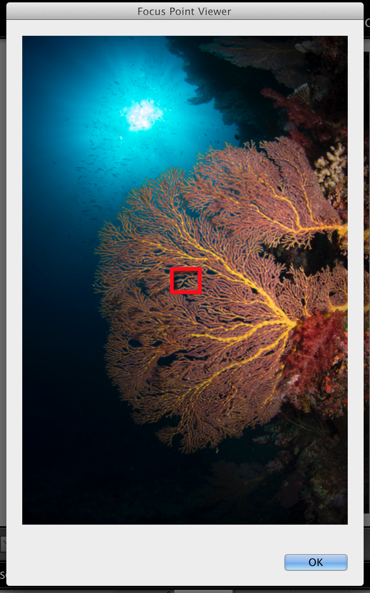

Focus Points
=======

A plugin for Lightroom to show which focus point was active when the picture was taken

Installing
--------
TODO: Write me

Adding your own camera
--------
TODO: Write me

Known Issues
--------
1. Lightroom does not allow for resizing of images or dynamically creating a box with a frame. As such, 
the focus point image can not be the exact size as your cameras. It can only estimate. 
2. Lightroom has a bug where lrPhoto:getDevelopSettings()["Orientation"] always returns nil. Lightroom does not
track if you have rotated the photo in development. As such, if the photo was rotated, the focus point could be 
wrong. The code attempts to resolve this, but it's only an attempt. 

TODOs
--------
 * check for "normal" to make sure the width is bigger than the height. if not, prompt
  the user to ask which way the photo was rotated
 * adjust point for rotation of crop
 * update the "MetaData" for an alphabetized order
 * show ExifTool license in plugin 

License
--------

    Copyright 2016 Joshua Musselwhite, Whizzbang Inc.

    Licensed under the Apache License, Version 2.0 (the "License");
    you may not use this file except in compliance with the License.
    You may obtain a copy of the License at

       http://www.apache.org/licenses/LICENSE-2.0

    Unless required by applicable law or agreed to in writing, software
    distributed under the License is distributed on an "AS IS" BASIS,
    WITHOUT WARRANTIES OR CONDITIONS OF ANY KIND, either express or implied.
    See the License for the specific language governing permissions and
    limitations under the License.

