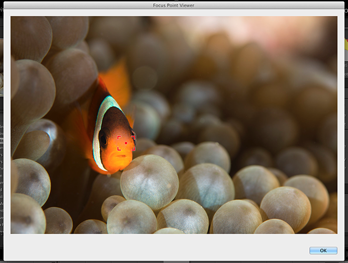
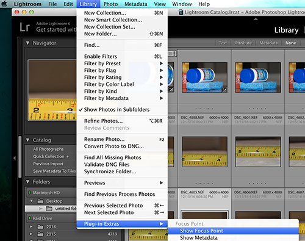
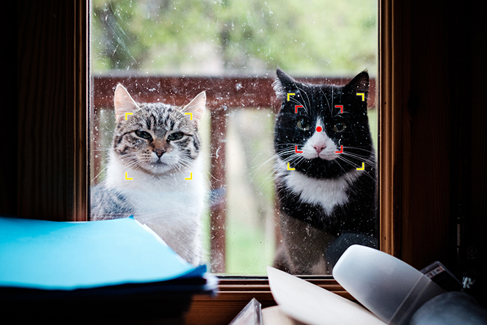

Focus Points
=======

A plugin for Lightroom (on Mac) to show which focus point was active when the picture was taken.




Supported Cameras
--------
* Canon cameras - all EOS and point and shoots. 7D Mark ii, 5D Mark iii, 5D Mark iv, 350D, 40D, 50D, 60D, 80D, 7D, 5D, etc, Powershot G12, G16, G1X, G5X, IXUS 310 HS, SX30, SX40 HS
* Nikon D7100, D7200
* Nikon D800 (and possibly D810 and D800E), D700.
* Fuji all recent X bodies (X-T2, X-T1, X-T10, X-Pro2, X-Pro1, X-A3, X-A2, X-A1, X-A10, X-E2S, X-E2, X-E1, X100T, X30, X70, etc)
* Olympus cameras (Should work on recent E-* bodies)


Installing
--------
1. Use the green button in this webpage called "Clone or download".
2. Extract the zip and (optionally) rename the folder from "focuspoints.lrdevplugin" to "focuspoints.lrplugin"
3. Move this folder to where you'd normally kept your Lightroom plugins.
4. Open Lightroom and go to File -> Plug-in Manager. Then click the "Add" button and select the folder
5. Once installed, in Library mode with a photo selected go to "Library -> Plug-in Extras -> Focus Point"


Supported AF-Points
--------
Currently, 5 types of AF-points will be displayed :

*  The AF-Point is selected and in focus
*  The AF-Point is selected
*  The AF-Point is in focus
*  The AF-Point is inactive
*  A face was detected by the camera at this position


Please note that not all cameras save the needed information in the Exifs of the photo. Thus, the accuracy of the displayed points will greatly depend on whether or not your camera supports it.

Adding your own camera
--------
It's very likely your camera is already supported. So try the plugin first before doing anything. :)

If your camera reports its focus points dynamically, adding support for you camera should be easy. Simply update or create a new CameraDelegate which extracts the focus points. Update the PointsRendererFactory so it knows about this new camera.

If your camera does not report its focus points dynamically, such as in the case of Nikons, this should be as painless as possible. You will need to map all of your camera's focus points to pixel coordinates. Refer to the "focus_points/nikon corporation/nikon d7200.txt" as an example.
```
-- 1st column
B1 = {810, 1550}
C1 = {810, 1865}
D1 = {810, 2210}

-- an so on
```
The best way I found to do this was to set up a ruler/tape measure, get out my camera and I took a photo at each of the focus points lining it up exactly with the 1-inch mark. I then imported those pictures into Lightroom and ran this plugin so I could see the metadata. From the metadata, I could see the focus points name. I then took the image into photoshop and measured from the top left corner of the image to the top left corner of the focus point. I compared the preview from the camera to my photoshop selection and got as close as possible. Once you have done all of that, add the file to "focus_points/{camera_maker}/{camera_model}.txt" using all lowercase. Then all is done.

If 2 or more cameras share a common points mapping, simplying add that to the list of known duplicate as in the NikonDuplicates file. With this, both Nikon D7100 and Nikon D7200 will share the same mapping file. 


Known Issues
--------
1. Not currently working on Windows.
2. Not compatible if photo was edited in Photoshop. 3rd party tools often remove the necessary metadata from the image. 


Contributing as a Developer
--------
Please see the Contributing.md file before being any new work.


License
--------

    Copyright 2016 Joshua Musselwhite, Whizzbang Inc.

    Licensed under the Apache License, Version 2.0 (the "License");
    you may not use this file except in compliance with the License.
    You may obtain a copy of the License at

       http://www.apache.org/licenses/LICENSE-2.0

    Unless required by applicable law or agreed to in writing, software
    distributed under the License is distributed on an "AS IS" BASIS,
    WITHOUT WARRANTIES OR CONDITIONS OF ANY KIND, either express or implied.
    See the License for the specific language governing permissions and
    limitations under the License.

