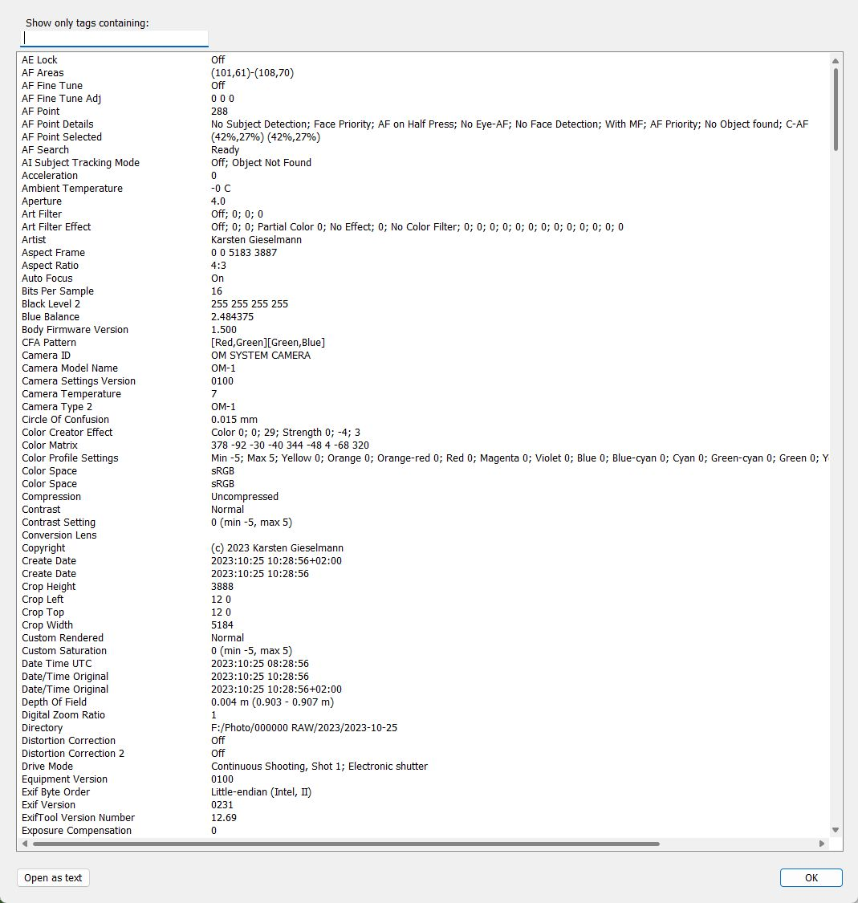
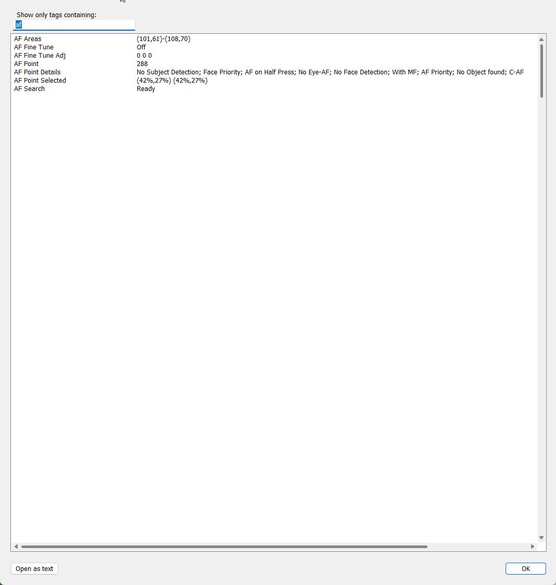

Focus Points
=======

A plugin for Lightroom Classic (LrC) to show which focus point was active when the picture was taken.

See [Scope and Limitations](docs/Focus Points.md#Scope and Limitations) for more detailed information relevant to users.


Current Release
--------
## V2.1.0, January 27, 2025
* Full support of Nikon Z series (except Z50ii and Zf):
  * Z5, Z6, Z6ii, Z6iii (#198 ), Z7, Z7ii, Z8, Z9, Z30, Z50, Z fc - CAF and PDAF focus points
  * Z50ii, Z f - currently only CAF focus points (missing PDAF test files!)
* Includes exiftool 13.15 (required for #198)
* Windows: Fix an issue with blurry images / error message when launched in Develop module #199
  - When launched in Develop module the plugin switches to Library loupe view so that a preview can be generated if none exists. 
  - Plugin returns to Develop after its window has been closed.

For history of versions and changes as well as planned, future improvements see [changelog.](docs/changelog.md)

[Download release](https://github.com/musselwhizzle/Focus-Points/releases/tag/v2.1.0)


Supported Cameras
--------
* Canon cameras 
  * all EOS and point and shoots. 
  * 7D Mark ii, 5D Mark iii, 5D Mark iv, 350D, 40D, 50D, 60D, 70D, 80D, 7D, 5D, etc, 
  * Powershot G12, G16, G1X, G5X, IXUS 310 HS, SX30, SX40 HS
* Nikon
  * DSLR: D7100, D7200, D700, D800 (possibly D810 and D800E), D5500, D5300, D5200, D300
  * Mirrorless (Z series):
    * Z5, Z6, Z6ii, Z6iii, Z7, Z7ii, Z8, Z9, Z30, Z50, Z fc - CAF and PDAF focus points
    * Z50ii, Z f - currently only CAF focus points (missing PDAF test files!)
* Sony E-Mount cameras
  * all full frame bodies beginning with &alpha;7 III resp. &alpha;7R II
  * APS-C
    * &alpha;6100, &alpha;6400, &alpha;6500, &alpha;6600, ..
* Fuji cameras 
  * all recent X bodies (X-T2, X-T1, X-T10, X-Pro2, X-Pro1, X-A3, X-A2, X-A1, X-A10, X-E2S, X-E2, X-E1, X100T, X30, X70, etc)
* Olympus cameras 
  * DSLR: E-5, E-420, E-520, E-620
  * Mirrorless: E-M1, E-M5, E-M10
* OM System cameras
  * OM-1, OM-5
* Panasonic cameras
* Pentax ([full list](focuspoints.lrdevplugin/focus_points/pentax/README.md))
  * Tested
    * K-50, K-S1, K-5 II, K-5 IIs, K-5, K-30, K-7, K20D, K-r, K200D, K10D, K110D, K100D Super, K100D, *ist DS2, *ist DS, *ist D
  * Working, but missing features
    * K-1, K-3, K-3 II
  * Untested, but should work:
    * KP, K-70, K-S2, K-500, K-x
* iphone and ipad


Installing
--------
**Installation steps**
1. Download the _**source code.zip**_ file from [latest release](https://github.com/musselwhizzle/Focus-Points/releases/latest).
2. Extract the zip and (optionally) rename the folder from "focuspoints.lrdevplugin" to "focuspoints.lrplugin"
3. Move this folder to where you'd normally kept your Lightroom plugins.<br>Hint: if you don't know this folder, the Plugin Manager will show you (see next step)" 
4. Open Lightroom and go to File -> Plug-in Manager. Then click the "Add" button and select the folder
5. Once installed, in Library mode with a photo selected go to "Library -> Plug-in Extras -> Focus Point" 
   or alternatively (also in Develop mode) "File -> Plug-in Extras -> Focus Point".
6. Windows only: Select the display scaling factor. Use the same or similar to the Windows configuration (Settings -> Display -> Scale). The default is 100%.


Supported AF-Points
--------
Currently, 5 types of AF-points will be displayed :

*  The AF-Point is selected and in focus
*  The AF-Point is selected
*  The AF-Point is in focus
*  The AF-Point is inactive
*  A face was detected by the camera at this position


Please note that not all cameras save the needed information in the Exifs of the photo. Thus, the accuracy of the displayed points will greatly depend on whether or not your camera supports it.

Metadata viewer
--------
The plugin also features a metadata viewer with live search. This comes in handy eg. for viewing information like FocusDistance from Maker Notes section, which Lightroom doesn't read and display via its UI.
The information is fetched (by Phil Harvey's exiftool) directly from the image file on disk so that this gives the full picture of metadata written by the camera:

         

<!--
Adding your own camera
--------
It's very likely your camera is already supported. So try the plugin first before doing anything. :)

If your camera reports its focus points dynamically, adding support for you camera should be easy. Simply update or create a new CameraDelegate which extracts the focus points. Update the PointsRendererFactory so it knows about this new camera.

If your camera does not report its focus points dynamically, such as in the case of Nikons, this should be as painless as possible. You will need to map all of your camera's focus points to pixel coordinates. Refer to the "focus_points/nikon corporation/nikon d7200.txt" as an example.
```
-- 1st column
B1 = {810, 1550}
C1 = {810, 1865}
D1 = {810, 2210}

-- an so on
```
The best way I found to do this was to set up a ruler/tape measure, get out my camera and I took a photo at each of the focus points lining it up exactly with the 1-inch mark. I then imported those pictures into Lightroom and ran this plugin so I could see the metadata. From the metadata, I could see the focus points name. I then took the image into photoshop and measured from the top left corner of the image to the top left corner of the focus point. I compared the preview from the camera to my photoshop selection and got as close as possible. Once you have done all of that, add the file to "focus_points/{camera_maker}/{camera_model}.txt" using all lowercase. Then all is done.

The camera model must only contain characters valid on all supported file systems. If a character is not valid (for example '\*' in the model "PENTAX \*ist D") it must be mapped to a valid character combination.
The mapping is done in PointsUtils.readFromFile(): '\*' -> '\_a\_'. 

If 2 or more cameras share a common points mapping, simplying add that to the list of known duplicate as in the NikonDuplicates file. With this, both Nikon D7100 and Nikon D7200 will share the same mapping file. 


Known Issues
--------
1. Not compatible if photo was edited in Photoshop. 3rd party tools often remove the necessary metadata from the image. 
-->

Contributing as a Developer
--------
Please see the [Contributing.md](Contributing.md) file before being any new work.

Special Thanks
--------
There's been a lot of man-hours put into this effort so far. All volunteer. So help me in thanking the individuals who has worked hard on this. First off, thanks for Phil Harvey for providing the 3rd party library ExifTool. The following is a list of the individual contributors on this project. These guys have fixed bugs, added camera support, added face detection, added support for your iphone, and many other cool features. (If you are a dev and I've missed you, please feel free to update this file or add your real name):

rderimay, philmoz, project802, jandhollander, DeziderMesko, StefLedof, roguephysicist, ropma. 

<a href="https://github.com/musselwhizzle/Focus-Points/graphs/contributors">Full list can be seen here.</a>

License
--------

    Copyright 2016 Whizzbang Inc.

    Licensed under the Apache License, Version 2.0 (the "License");
    you may not use this file except in compliance with the License.
    You may obtain a copy of the License at

       http://www.apache.org/licenses/LICENSE-2.0

    Unless required by applicable law or agreed to in writing, software
    distributed under the License is distributed on an "AS IS" BASIS,
    WITHOUT WARRANTIES OR CONDITIONS OF ANY KIND, either express or implied.
    See the License for the specific language governing permissions and
    limitations under the License.

