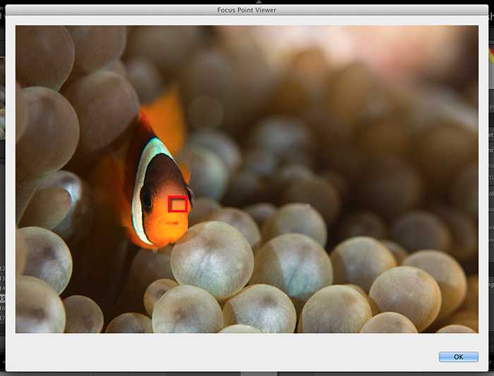

Focus Points
=======

A plugin for Lightroom to show which focus point was active when the picture was taken




Supported Cameras
--------
* Nikon D7200
* Nikon D800
* Fuji cameras: at least recent ones as X-T1, X-T2, X-Pro1, X-Pro2, X-T10, X100T, X30, X70


Installing
--------
1. Use the green button in this webpage called "Clone or download".
2. Extract the zip and (optionally) rename the folder from "focuspoints.lrdevplugin" to "focuspoints.lrplugin"
3. Move this folder to where you'd normally kept your Lightroom plugins.
4. Open Lightroom and go to File -> Plug-in Manager. Then click the "Add" button and select the folder
5. Once installed, in Library mode with a photo selected go to "Library -> Plug-in Extras -> Focus Point"


Adding your own camera
--------
If you wish to contribute, this should be as painless as possible. You will need to map all of your camera's focus points to pixel coordinates. Refer to the "focus_points/nikon corporation/nikon d7200.txt" as an example.
```
-- 1st column
B1 = {810, 1550}
C1 = {810, 1865}
D1 = {810, 2210}

-- an so on
```
The best way I found to do this was to set up a ruler/tape measure, get out my camera and I took a photo at each of the focus points lining it up exactly with the 1-inch mark. I then imported those pictures into Lightroom and ran this plugin so I could see the metadata. From the metadata, I could see the focus points name. I then took the image into photoshop and measured from the top left corner of the image to the top left corner of the focus point. I compared the preview from the camera to my photoshop selection and got as close as possible. Once you have done all of that, add the file to "focus_points/{camera_maker}/{camera_model}.txt" using all lowercase. Then all is done.

If 2 or more cameras share a common points mapping, then PointsRendererFactory will need to be updated to know this. For example, the D7200 and D7100 could share a common focus points map (I don't know). If they do, PointsRendererFactory can be updated in code. I would prefer not see copying and pasting of focus point files such as "nikon d7200.txt" and "nikon d7100.txt" containing the exact same info.


Known Issues
--------
1. Lightroom does not allow for resizing of images or dynamically creating a box with a frame. As such,
the focus point image can not be the exact size as your cameras. It can only estimate.
2. Lightroom has a bug where lrPhoto:getDevelopSettings()["Orientation"] always returns nil. Lightroom does not
track if you have rotated the photo in development. As such, if the photo was rotated, the focus point could be
wrong. The code attempts to resolve this, but it's only an attempt.
3. Not compatible if photo was edited in Photoshop. If the photo has been edited in Photoshop, the metadata in the photo telling the focus point was deleted. Perhaps in the future I can update the code to look for the original file and get the focus point from that.


TODOs
--------
 * check for "normal" to make sure the width is bigger than the height. if not, prompt
  the user to ask which way the photo was rotated
 * update the "MetaData" for an alphabetized order
 * show ExifTool license in plugin


License
--------

    Copyright 2016 Joshua Musselwhite, Whizzbang Inc.

    Licensed under the Apache License, Version 2.0 (the "License");
    you may not use this file except in compliance with the License.
    You may obtain a copy of the License at

       http://www.apache.org/licenses/LICENSE-2.0

    Unless required by applicable law or agreed to in writing, software
    distributed under the License is distributed on an "AS IS" BASIS,
    WITHOUT WARRANTIES OR CONDITIONS OF ANY KIND, either express or implied.
    See the License for the specific language governing permissions and
    limitations under the License.

