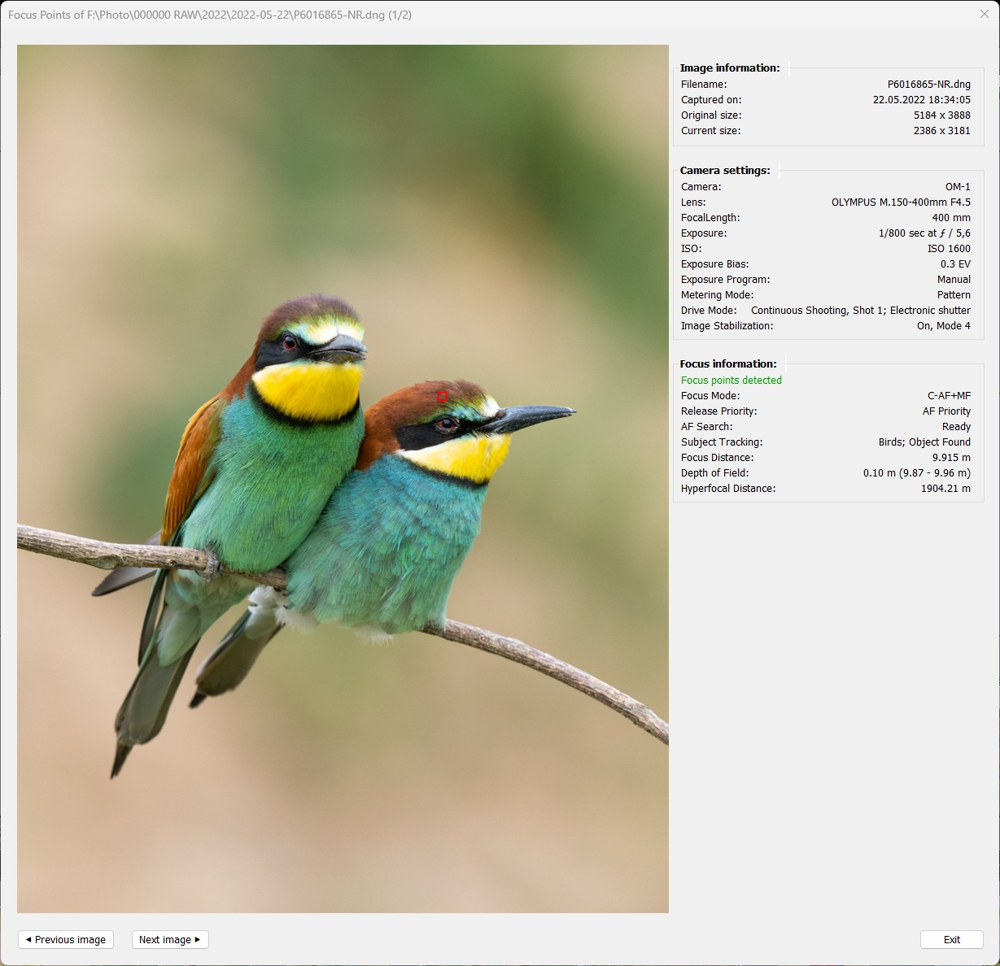
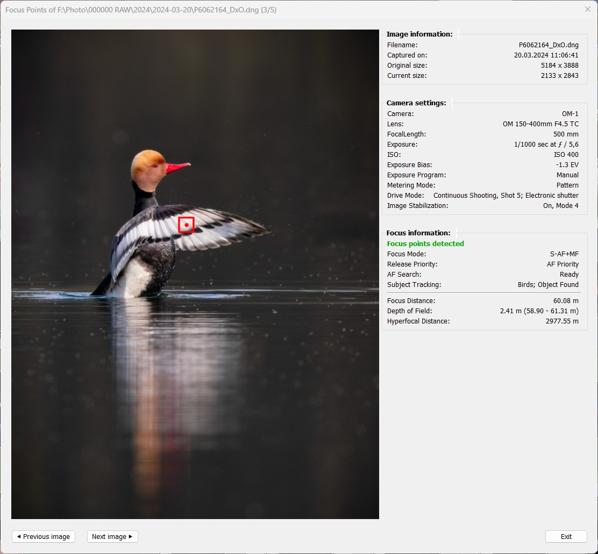

Focus Points Plugin for Lightroom Classic
=======

## Content ##

### [Scope and Limitations](#1-scope-and-limitations)

### [Overview and Basic Operation](#2-overview-and-basic-operation)

*  [Installation](#21-installation)
*  [Configuration and Settings](#22-configuration-and-settings)
*  [Focus Point Viewer](#23-focus-point-viewer)
*  [Metadata Viewer](#24-metadata-viewer)

### [Display of Focus Points](#3-display-of-focus-points)

*  [Nikon](#31-nikon)

* [Canon](#32-canon)

* [Sony](#33-sony)

* [Fuji](#34-fuji)

* [Olympus / OM System](#35-olympus--om-system)

* [Panasonic](#36-panasonic)
 
* [Pentax](#37-pentax)

* [Apple](#38-apple)

### [Glossary](#4-glossary)

### [Troubleshooting](Troubleshooting_FAQ.md#troubleshooting--faq)

___

## 1. Scope and Limitations

A plugin for Lightroom Classic (LrC on Windows, macOS) to 
- show which focus point was active when the picture was taken.
- display (EXIF) metadata of the selected image

**Principle of operation:**  
The plugin uses [exiftool](https://exiftool.org/) to retrieve EXIF metadata from the image file. Autofocus related information is extracted from metadata and is processed to visualize the focus points. In order for this to work, the plugin requires an image file that has camera maker specific metadata information (_makenotes_) included.

Note: exiftool comes as part of the plugin package and does not need to be installed separately. 

The plugin will not be able to show focus points for image files that don't have makernotes included.  
For this it is important to understand that Lightroom does not read or keep makernotes when importing files. 
Whenever a separate image file is created from the original file, there is a risk that makernotes will not be present in this file and the plugin does not have the required inputs to work.

Examples, for which focus points cannot be displayed:
- original image edited in Photoshop and returned as PSD or TIF
- original image transferred as TIFF/JPG to a 3rd party editor (Photo -> Edit In) and returned as TIF,  e.g. Topaz, NIK, Photomatix 
- photos exported to harddisk

For external applications started from Lightroom that take a RAW file as input (invoked via  Plugin Extras), the plugin may work on the resulting file imported into Lightroom, if the application leaves makernotes intact. 

Examples, for which focus point display may work on image files created based on original files. Finally, this depends on the specific camera make/model:
- DNG files created by DxO PhotoLab, Luminar Neo, Topaz Photo AI
- DNG files created by LrC Enhance, e.g. AI Denoise

Other cases where the Focus Points plugin will not be able to display meaningful information:

* the picture has been taken by focusing on the main subject, then panning the camera to get the desired composition.
 

## 2. Overview and Basic Operation
This section explains how the plugin is used.

### 2.1 Installation
1. Unless you have been given a special link (e.g. for a pre-release) download the _**source code.zip**_ file from [latest release](https://github.com/musselwhizzle/Focus-Points/releases/latest).
2. Unzip and rename the extracted folder from "focuspoints.lrdevplugin" to "focuspoints.lrplugin"
3. Move this folder to where you'd normally kept your Lightroom plugins. Hint: if you don't know this folder, the Plugin Manager will show you (see next step) 
4. Open Lightroom and go to File -> Plug-in Manager. Then click the "Add" button and select the folder
5. Once installed, in Library mode with one or multiple photos selected go to "Library -> Plug-in Extras -> Focus Point" 
   or alternatively (also in Develop mode) "File -> Plug-in Extras -> Focus Point".
6. Windows only: Select the display scaling factor. Use the same or similar value as set for Windows configuration (Settings -> Display -> Scale). The default is 100%.

### 2.2 Configuration and Settings

Selecting Focus Point Viewer in the list of installed plugins (Library module, File -> Plug-in Manager) displays the plugin's preferences page:    

**Screen Scaling**

 _Display scaling factor_  
Windows only. In order to avoid that the plugin window can get bigger than the size of the screen this setting should be same or similar to the Windows configuration (Settings -> Display -> Scale). The default is 100%. 

**Viewing Options**

_Size of focus box for 'focus pixel' points_  
Depending on the camera maker, focus points can have dimension (width and height), thus forming a focus box. Some makers represent focus points by a single 'focus pixel'. To ensure their visibility, such focus pixel points are represented by a focus box. You can choose whether the box shall be small or medium/large with a center dot.

_Color of in-focus points_  You can choose between three different colors for the presentation of focus point boxes: red, green and blue.

**Logging**

In case the plugin doesn't work as expected, the progress can be logged to help pinpointing where things went wrong. Use these controls to set the logging level (Info, Warning, Error, Debug) and open a log file that has just been created.

### 2.3 Focus Point Viewer
Once the plugin has been installed, it can be invoked with one or more photos selected:

Library module:  
"Library -> Plug-in Extras -> Focus Point" 

Develop module: 
"File -> Plug-in Extras -> Focus Point" 
 
 
#### User interface (single image operation): ####

The window is split in two parts. The photo view with visualized focus points on the left and side-by-side on the right the display of selected metadata relevant information that may be helpful for assessing the photo with respect to focus results. 

The information section comprises three groups:
- Image information
- Camera settings
- Focus information

Parts of image information and camera settings come from the LrC catalog, so this information is present for every photo. These sections may be extended by camera specific items like crop mode, drive mode etc., depending on the availabity of information in makernotes.  

Focus information is only present for those photos where the corresponding image file has full metadata included. See [Scope and Limitations](#1-scope-and-limitations) for more detailed information.
 
 

#### Depth of Field, Hyperfocal Distance ####
Even though 'Depth of Field' and 'Hyperfocal Distance' are part of the "Focus Information" group, this information is displayed for most makers (except Fuji and Apple). The plugin displays this subsection always in the same format, that's why it's covered here.

Most cameras include Focus Distance information in makernotes. ExifTool uses this information to calculate Depth of Field (DoF) which can be helpful to assess whether the lens has been stopped down enough to capture a subject 'acceptably sharp', i.e. whether the desired portion of the subject is 'in focus'. ExifTool also calculates Hyperfocal distance, which can help to assess if for photos that should be sharp from front to back (e.g. landscapes) autofocus has been aimed at a proper distance.

Note that the precision of Focus Distance values is limited. Cameras are not designed to measure distances. The values given in EXIF data are by-products of the focusing process, derived from control information to send the lens to a certain distance. Such focus step counts can be converted approximately into a distance. While this information is likely to be  inaccurate especially in extreme conditions (in macro range or towards infinity), it is usually good enough to be used in DoF considerations for 'normal' distances.

Technical note: ExifTool creates pseudo tags DepthOfField and HyperfocalDistance which can be seen in ExifTool output. For calculation of DoF it uses the standard circle of confusion parameter* for the respective sensor. In this context, the term “sharpness” refers to the ability of the human eye to recognize and resolve details when an image is viewed at full size, i.e. not enlarged, also known as “pixel peeping”. 

Example: DoF in this capture is only ~2 cm, so with the chosen aperture of f/1.8 the eyes will be outside the sharp zone if the shot is focused on the front whiskers.

#### User Messages ####

If focus information is present for the photo and focus points have been detected this is indicated by a message highlighted in green - see images above.

In case focus information is missing or no focus points have been detected (e.g. for manually focused photos) this will be indicated by a message in red letters:

The window can be closed by clicking "OK" or pressing \<Enter> or \<Esc> or \<Space>.
 
 
<b>User interface (multi-image operation):</b>

When run on a selection of photos, the user interface of Focus Point Viewer offers two additional buttons that enable the user to move forwards and backwards within the series of selected photos.

The window can be closed by clicking "Exit"  or pressing \<Enter> or \<Esc> or \<Space>.

### 2.4 Metadata Viewer
Will be documented later

## 3. Display of Focus Points
The subchapters in this section describe in more detail which focus point features are supported by the plugin for individual camera makers and specific lines or models. This can be different colors for different statuses (e.g. focus point selected, in focus, inactive), or face/subject detection frames. The level to which such features can be supported ultimately depends on the availability of corresponding data in EXIF maker notes.

Even if certain data is stored by a camera maker it doesn't mean at the same time that it's "available". 
_Makernotes_ is a proprietary metadata section that contains manufacturer-specific information that is not standardized across different brands. Camera makers can use this information to diagnose camera issues, for instance.

The Focus Points plugin fully relies on what [ExifTool](https://exiftool.org/) is able to decode and display. Which in turn doesn't fall from the sky, but it's a collaborative effort by camera owners worlwide that are willing to contribute and [go where no man has gone before](https://exiftool.org/#boldly) and decode the unknown.      

## 3.1 Nikon

The logic for interpreting Nikon-specific autofocus data has been adapted to match the focus point display of NX Studio and Capture NX-D. While this is not rocket science for Nikon Z, it has been a real challenge for Nikon DSLRs. For these, Nikon stores different kind of focus point information in different places, making it difficult for those maintaining ExifTool to figure out the relevant information and name it consistently. I would like to take this opportunity to thank Warren Hatch for his great support in deciphering and correctly interpreting the Nikon AF information! 

Nikon focus point information in EXIF metadata always refer to an area within the frame. For CAF results these are the coordinates (x,y, height, width). For PDAF results it's the name(s) of focus points (e.g. A1, C6, E4), which the plugin maps to the corresponding pixel coordinates. 

Hence, for Nikon focus points, you can select the color of the box but not their size.

Nikon metadata does not include details on face or subject detection, that's why you won't see any corresponding detection frames. This does not mean that this information is not existing in the file - it simply has not been decoded yet by maintainers and active supporters of ExifTool.

### 3.1.1 Nikon DSLR

Nikon DSLRs usually feature two autofocus systems. A high performance phase detect autofocus (PDAF) and
a slower contrast autofocus when using live view.

Position and size of PDAF focus points are determined by the individual sensor AF layout of the camera model. PDAF points cover only a portion of the frame. For DSLRs with their limited focus coverage, the entire matrix of focus points is visualized along with the in-focus point.

Example - Single Area shot:

Example - Group Area shot:

For Contrast AF, the size of the focus "point" is a larger box that varies, depending on the shooting conditions:

### 3.1.2 Nikon Mirrorless

Nikon Mirrorless cameras feature a hybrid autofocus system, where PDAF and CAF cooperate to achieve fast and precise focus. While earlier models like the Z6 produced a fair amount of images with PDAF results, those images become rare in modern cameras like the Z9, with CAF technology getting more capable.

Early Z models feature an 81-point (9x9) PDAF, for Z8/Z9 this has grown to 493 points (27x15). In contrast to DSLRs, the information about inactive (not used) focus points is less useful here, so it is not displayed.

Example for Contrast AF (with subject detection "People"):

Example for Phase Detect AF (PDAF):

## 3.2 Canon

Canon focus point information in EXIF metadata always refers to an area within the frame. Focus point areas are given by their coordinates (x,y, height, width).

Hence, for Canon focus points, you can select the color of the box but not the size.

Canon metadata does not include details on face or subject detection, that's why you won't see any corresponding detection frames. This does not mean that this information is not existing in the file - it simply has not been decoded yet by maintainers and active supporters of ExifTool.

Unlike many other makers, Canon does not give a single focus distance value, but a pair of values for lower and upper indicating the range.

### 3.2.1 Canon DSLR

As with Nikon, Canon DSLRs support both PDAF and CAF. The position and size of PDAF focus points are determined by the individual sensor AF layout of the camera model. 

PDAF-focused shot with multiple focus points used:

CAF-focused shot using the 'green' color setting for better visibility:

### 3.1.2 Canon Mirrorless

As with Nikon, Canon mirrorless models feature a hybrid autofocus system. However, in terms of focusing information stored in EXIF, the cooperation of PDAF and CAF is transparent. You can find the x, y positions of the focus point area(s) used to focus the shot as well as their width and height always in the same format.

Shot with 'Animal' subject detection:

When capturing flat subjects, focus point display for Canon R-series can be funny sometimes: 

Remark: The display of "AF Tracking Sensitivity" and "AF Point Switching" in the above screenshot indicate that the respective values have not been properly decoded by ExifTool. If you suspect such decoding issue and would really like to see the real values, you can help to fix it by creating a topic in ExifTool Forum, describing it and be prepared to provide sample images. ExifTool is very well maintained and likelihood is big that issues brought to notice will be quickly fixed (unless the topic is difficult).   

## 3.3 Sony

Sony supports face detection on almost all of their mirrorless (alpha) and also compact (RX series) camera. The plugin can display the yellow face detection frames even on images taken with cameras 14 years back where it's not possible to detect focus points using EXIF data.

On Sony, the size of the focus point box is determined by the size of a PDAF point (or focal plane autofocus point, in Sony terminology). So, the color of the box can be changed in plugin preferenes but not its size.

As for the settings in Sony's AF menu, in contrast to Canon and Nikon there's not much that you can find in EXIF makernotes. That's why the focus information section is rather empty. Sony also doesn't have a focus distance tag, so there is no Depth of Field section either.

## 3.4 Fuji

Fuji is the king of autofocus metadata. For no other camera maker there is so comprehensive information on focus points and subject detection available in EXIF as for Fuji. No matter if a detected subject was a human, an animal, a bike, car, aircraft or train and the detected eye was a real eye or a cockpit - all information to visualize a detected subject and the parts of it is stored in the same place and format.

Fuji focus points are 'focus pixel' points without a dimension that is linked to the focusing process. For improved visualization you can choose focus box size and color in the plugin's preferences. 

Example shot for face detection (2 persons with their heads, faces, and eyes detected, indicated by yellow frames).

Example shot for subject detection. 4 birds  detected (with different levels of details): 

## 3.5 Olympus / OM System

Olympus and their successor OM System have been using the same format of storing autofocus information in EXIF for all mirrorless cameras, so focus point display for all of their models is the same.

Olympus / OM System belongs to the 'focus pixel' point group of camera makers. Focus box size and color can be adjusted in the plugin's preferences.

Olympus makernotes does contain data on face detection. However, the necessary details of this information are not present in Exiftool standard output which is the current basis for the plugin to work. A future version of the plugin might use Exiftool in 'stay-open' mode, which could bring a number of improvements, including query of any kind of metadata information.

Compared to the display of focus points in OM Workspace, there are sometimes slight deviations. This is due to the fact, that Exiftool standard output as used by the plugin contains the focus point coordinates as a string "(x%,y%)" with 0 < x,y 100 giving the position in percent of width and height of the frame. In fact, metadata contains pixel precise informion, so there could be a rounding error up to 0.5% ~ 26px on the long edge, 20px on the short edge. While it is not critical for practical applications, using exiftool in 'stay-open' mode would also help to solve this issue.    

Using the focus box settings the display of the focus point can be tweaked to look like Olympus / OM shooters are used to it from OM Workspace application: 

## 3.6 Panasonic

Similar to Olympus, Panasonic hasn't changed the logic of focus point data since ages. Since 2008, to be precisely. They are sharing the same logic and format across all of their cameras. This is why Panasonic cameras are widely support, across model lines from mirrorless over bridge down to compact cameras.

Panasonic is another member of "focus pixel" group, so you can choose focus box size and color in the plugin's preferences.  

Panasonic also supports face detection identification in EXIF metadata. This information is available for recent mirrorless models, for compact cameras I have seen an ZS20 (2012 model!) image that uses the same logic and notation for face detection frames (displayed in yellow).

## 3.7 Pentax

To be updated with release of V2.6

## 3.8 Apple

Apple maintains a very simple logic to store the focused subject areas in EXIF metadata. This hasn't changed since early models (at least iPhone 5).

The makernotes section is rather short; older models do not even have an "Apple" section. Apart from the focus area there is no relevant information to be shown:

Modern iPhones there are some interesting tags to extend the camera settings section. The amount of AF relevant tags however is limited. ExifTool can decode tags like AF Performance, AF Measured Depth or AF Confidence but their meaning is not documented and thus the related values are meaningless.

## 4 Glossary

to be created
