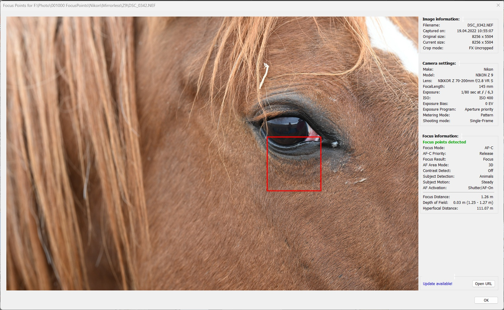
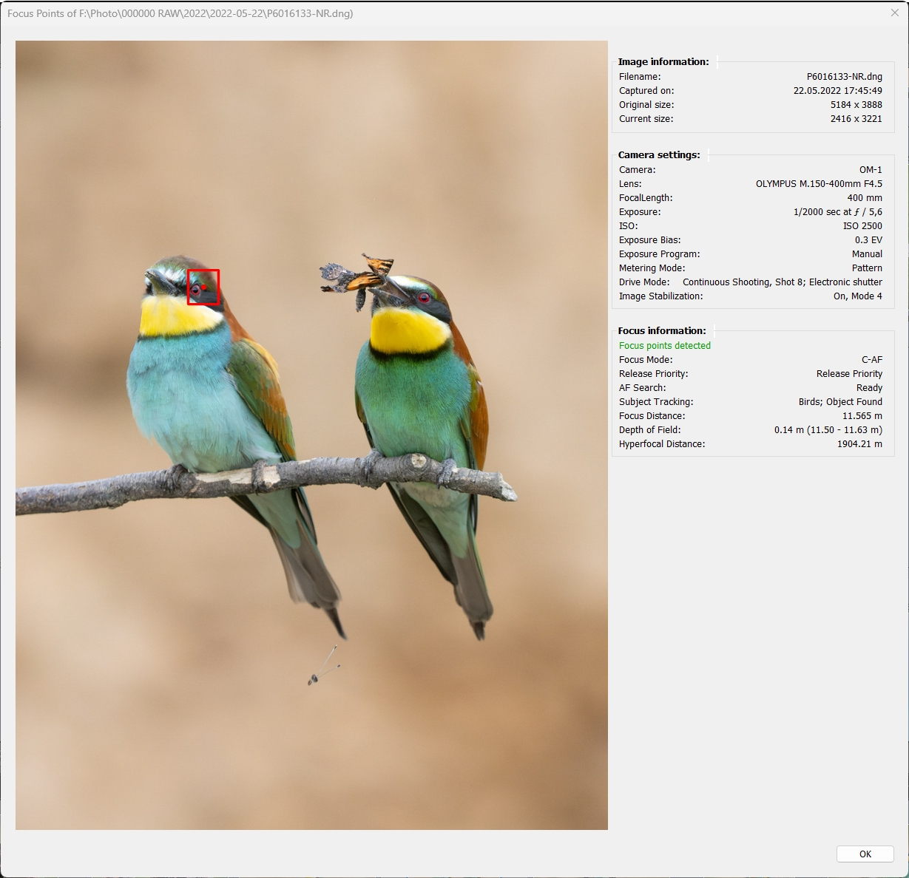
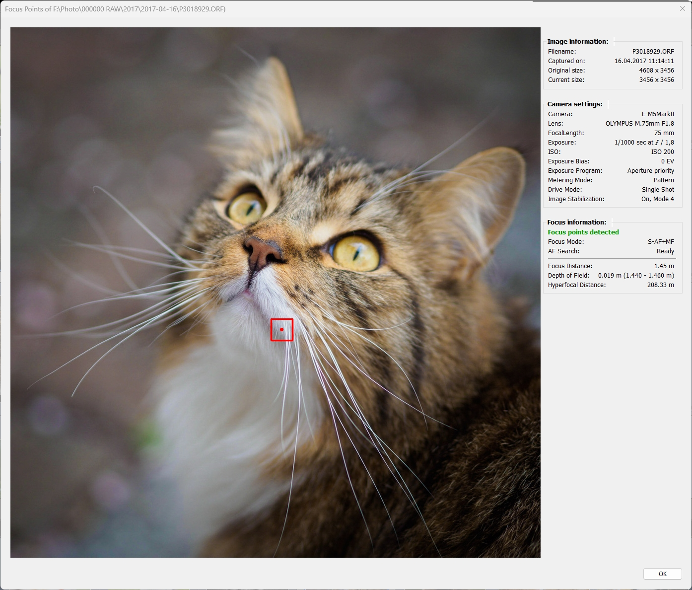
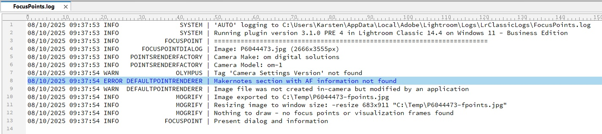

Focus Points Plugin for Lightroom Classic
=======

## Content ##

### [Troubleshooting / FAQ](Troubleshooting_FAQ.md#troubleshooting--faq)

### [Scope and Limitations](#1-scope-and-limitations)

### [Overview and Basic Operation](#2-overview-and-basic-operation)

*  [Installation](#21-installation)
*  [Configuration and Settings](#22-configuration-and-settings)
*  [Focus Point Viewer](#23-focus-point-viewer)
*  [Metadata Viewer](#24-metadata-viewer)

### [Display of Focus Points](#3-display-of-focus-points)

* [Canon](#32-canon)
  
* [Nikon](#31-nikon)

* [Sony](#33-sony)

* [Fuji](#34-fuji)

* [Olympus](#35-olympus)

* [OM System](#36-om-system)

* [Panasonic](#37-panasonic)
 
* [Pentax](#38-pentax)

* [Ricoh](#39-ricoh)
 
* [Apple](#310-apple)

### [Appendix](#A-appendix)

* [How to use a keyboard shortcut to launch the plugin](#how-to-use-a-keyboard-shortcut-to-launch-the-plugin)

### [Glossary](#G-glossary)

___

## 1. Scope and Limitations

A plugin for Lightroom Classic (LrC on Windows, macOS) to 
- Show which focus point was active when the picture was taken.
- Display user-selected autofocus points/area1,2
- Visualize faces and subjects detected by the camera1,3 
- Display (EXIF) metadata of the selected image

1 Depending on the presence of metadata. 
2 Currently supported for Pentax and OM System.      
3 Currently supported for Fuji and OM System (subjects, faces) and Sony, Olympus, Pentax (faces).
 
 

<big>**Principle of operation**</big>
 

The plugin uses [ExifTool](https://exiftool.org/) to retrieve metadata from the image file. Autofocus related information is extracted from the metadata and processed to detect and visualize focus points, faces and subjects. For this to work, the plugin needs an image file that contains camera manufacturer specific metadata information (_makernotes_) as written by the camera to each JPG or RAW file. The plugin will not be able to show focus points for image files that do not contain makernotes. 

<u>Note:</u> ExifTool is part of the plugin package and does not need to be installed separately. 

Because the plugin works inside Lightroom, it is important to understand that Lightroom **does not read** makernotes information when importing files. When the plugin is run on a selected photo, it calls ExifTool to process the underlying image file on disk. When Lightroom exports a photo as JPG or TIFF to pass to an external application for editing, it creates a new image file without the makernotes metadata. The re-imported result from that application will not have this information, which is essential for the plugin to work.

**Examples of when focus points are not displayed:**
- Original image edited in Photoshop and returned as PSD or TIF
- Original image transferred as TIFF/JPG to a 3rd party editor (Photo -> Edit In) and returned as TIF,  e.g. Topaz, NIK, Photomatix 
- Photos exported to disk

For external applications launched from within Lightroom that take a RAW file as input (typically invoked from the 'Plug-in Extras' menu), the plugin may work on the resulting file imported into Lightroom if the application leaves the original file's makernotes intact. This is because in this case Lightroom does not physically pass on the file to the external application but only the name of the image file.

**Examples, for which focus point display may work on image files created based on original files:**  

- DNG files created by DxO PhotoLab, Luminar Neo, Topaz Photo AI
- DNG files created by LrC Enhance, e.g. AI Denoise (prior to LrC 14.4)

Note that this may depend on the specific camera make/model. E.g. for Fuji it does not.

**Cases where the Focus Points plugin may not be able to display meaningful information:**

* <u>Focus and Pan</u>: The shot was taken by focusing on the main subject and then panning the camera to get the desired composition. The focus point recorded by the camera does not "move" with the focused subject during recomposition, but maintains its original position.
* <u>Back button Focus</u>: This is similar to Focus and Pan because the underlying principle is the same. In addition, the camera may not even record a focus point (depending on the make/model). 

 

## 2. Overview and Basic Operation
This section explains how to use the plugin.

### 2.1 Installation
1. Unless you have a special link (e.g. for a pre-release), download the **source code.zip** file from [latest release](https://github.com/musselwhizzle/Focus-Points/releases/latest) (go to the bottom of this page to find the download link). A file named **Focus-Points-[plugin_version].zip** will be downloaded to your computer. 
_MAC users_: The zip file will be automatically unzipped according to your MacOS preferences.

2. Extract the downloaded file if necessary. Within the extracted contents, locate the plugin folder **focuspoints.lrplugin**

3. Move this folder to the location where you normally keep your Lightroom plug-ins. Tip: If you don't know this location, the Plugin Manager will tell you (see next step). 
_MAC users_: if you need to navigate into the content of the „adobe lightroom classic.app", use the control-click and choose  „show package content“. 

4. Open Lightroom and go to File -> Plug-in Manager. 
_Windows_: Click the "Add" button and select the plugin. 
_MAC_: If you copied the plugin to the default Lightroom plugin location, the new plugin is already listed - activate it. Otherwise, click the "Add" button and select the plugin.

Once installed, select one or more photos and invoke the plugin via
  * Library -> Plug-in Extras -> Show Focus Point, or  
  * File -> Plug-in Extras -> Show Focus Point

 

### 2.2 Configuration and Settings

Selecting Focus Point Viewer in the list of installed plugins (Library module, File -> Plug-in Manager) displays the plugin's preferences page:    

 

**Screen Scaling**

 _Display scaling factor_   
Windows only. Default setting: "Auto"

The drawing routines used on Windows are not aware of any display scale factor that may have been applied to the Windows configuration (Settings -> Display -> Scale). In order to avoid that the plugin window gets bigger than the screen size, the plugin has to reverse this scaling when calculating the size of the dialog window.

 The "Auto" setting causes the plugin to scale its windows in sync with a system scale factor. Optionally, a predefined fixed scale value can be selected, which avoids a registry access via an external command (REG.EXE) on each call of the plugin. The meaning of the predefined values 100%, 125%, 150%, etc. is the same as in the Windows Settings dialog. I.e. to undo a system-wide zoom of 150%, the same value '150%' must be selected from the drop-down list.
   

**Viewing Options**

Default settings: "Red, Medium"

_Size of focus box for 'focus pixel' points_  
Depending on the camera maker and model, focus points may have a dimension (width and height) or they may be represented by a 'focus pixel'. For focus points that have a dimension, a box with the specified width and height is displayed. For 'focus pixel' points you can choose how to display them: small box or medium/large with a center dot.

_Color of in-focus points_  You can choose between three different colors for the presentation of focus point boxes: red, green and blue.

**Logging**

Default setting: "Auto"

The logging feature serves two purposes:
1. Gather information to explain why focus points are not displayed
2. Gather information to help the developer figure out what went wrong if the plugin does not work as expected.

For 1. "Auto" is the recommended setting, because it logs relevant information that can help to understand why, for example, the plugin is not able to correctly determine the focus point(s) for a given image. If the plugin encounters any errors or warnings during its operation, it will provide a link to view the log for additional information. See example in "User Messages" below.

The logging mechanism provides a fine-grained hierarchy of levels at which information should be logged. Setting a certain logging level in the plugin preferences will cause all messages of that level to be written, including those at lower levels. description, from lower to higher levels:

   | Level   | Information logged                                                      |
   |---------|-------------------------------------------------------------------------|
   | None    | No logging output. No logfile created.                                  | 
   | Error   | Only error messages.                                                    |
   | Warning | + warnings                                                              |
   | Info    | + information on progress and intermediate results                      |
   | Debug   | + important debug information. No noticeable slow down.                 |   
   | Full    | Full debug information, including entire EXIF data. Slow down.          |
   | Auto    | Same as 'Info'. Recommended setting. No noticeable slow down of plugin. |              
   

<u>Hint</u>: "Auto" logging will start on an empty logfile for each image. When opening such a logfile, this will immediately focus on what just happened on the recent image. For all other logging levels, the logfile will be emptied only in case of loading the plugin, which happens at the time of starting LrC or explicitely reloading the plugin.  

**Updates**

During operation, the plugin checks if an updated version is available for download.
If an update is available, it will be highlighted and you can click the download button to go to the website. To install the update, follow the steps in [Installation](#21-installation) and reload the plugin.

If an update is available, it will also be displayed in the status area of the Focus Point Viewer if the "Show message" checkbox is selected:

 

### 2.3 Focus Point Viewer
Once the plugin is installed, you can run it with one or more photos selected:

Library module:  
"Library -> Plug-in Extras -> Focus Point" 

Develop module: 
"File -> Plug-in Extras -> Focus Point"

#### User interface ####

The window is divided into two parts. On the left is the photo view with visualized focus points and detected elements, and on the right is a side-by-side view of selected information that may be useful for evaluating the photo in terms of focus results. 

The information section comprises three groups:
- Image information
- Camera settings
- Focus information

Image information and camera settings are largely taken from the Lightroom catalog, so this information is available for every photo. Depending on the availability of information in the makernotes, these two sections may be expanded to include various camera-specific information such as crop mode, drive mode, shot number, etc., which may be useful in the context of evaluating focus results.

Focus information is only available for photos for which the corresponding image file contains complete metadata. See [Scope and Limitations](#1-scope-and-limitations) for more detailed information.

Two buttons at the bottom of the window allow you to move forward and backward through a series of photos, if more than one was selected in Lightroom when the plugin was launched.

A link to the User Guide (this document) provides quick and easy access to the operating instructions.  

The window can be closed by clicking "Exit" or pressing \<Enter> or \<Esc> or \<Space>. 

#### Depth of Field, Hyperfocal Distance ####

Most camera makers include subject or focus distance information in makernotes. Sony, Fuji and Pentax do not, so this section is not relevant to images taken with their cameras.    

ExifTool uses the focus distance information to calculate the depth of field (DoF), which can be helpful in assessing whether the lens is stopped down enough to capture a subject "acceptably sharp", i.e. whether the desired portion of the subject is "in focus". ExifTool also calculates the hyperfocal distance, which can be helpful in determining if the autofocus is set at the correct distance for photos that should be sharp from front to back (e.g. landscapes).

Note that the accuracy of focus distance values is limited. Cameras are not designed to measure distances. The values given in the EXIF data are byproducts of the focusing process, derived from control information to move the lens to a certain distance. Such focus step counts can be approximated as a distance. The degree of inaccuracy, and therefore the usefulness of this data, depends on several aspects. Typically, focus distance values are less accurate at short focal lengths. Also, this information is likely to be inaccurate under extreme conditions (macro or infinity). Finally, the equipment also plays a role.

Technical note: ExifTool creates pseudo tags DepthOfField and HyperfocalDistance which can be seen in ExifTool output. For calculation of DoF it uses the standard circle of confusion parameter for the respective sensor. In this context, the term “sharpness” refers to the ability of the human eye to recognize and resolve details when an image is viewed at full size, i.e. not enlarged, also known as “pixel peeping”. 

Example: DoF in this capture is only ~2 cm, so with the chosen aperture of f/1.8 the eyes will be outside the sharp zone if the shot is focused on the front whiskers.

 

#### User Messages ####

The first line of text in the "Focus Information" section contains a message summarizing whether the plugin was successful in its task to detect and visualize focus points. This can be a success message (in green letters), a warning (orange) or an error message (red):

|  Type   | Message |
|:-------:|---------------- |
| Success | Focus points detected |
| Warning | [No focus points recorded](Troubleshooting_FAQ.md#No-focus-points-recorded) |
| Warning | [Manual focus, no AF points recorded](Troubleshooting_FAQ.md#Manual-focus-no-AF-points-recorded) |
|  Error  | [Focus info missing from file](Troubleshooting_FAQ.md#Focus-info-missing-from-file) |
|  Error  | [Camera model not supported](Troubleshooting_FAQ.md#Camera-model-not-supported) |
|  Error  | [Camera maker not supported](Troubleshooting_FAQ.md#Camera-maker-not-supported) |
|  Error  | [Severe error encountered](Troubleshooting_FAQ.md#Severe-error-encountered) |

Click on the message to learn what it means and how to deal with it in case of an error or warning.

You can also access this information from the plugin window by clicking the link icon 🔗 next to the message: 

#### Plugin Status ####

If errors or warnings were encountered while processing the autofocus metadata, a status message is displayed at the bottom of the text pane. To the right of this message, you can click the "Check log" button to open the logfile for more details. The logfile contains detailed information about the metadata processing, such as relevant tags found (or not found). 
See also section "Logging" under [Configuration and Settings](#22-configuration-and-settings).

For the image above, where focus info is said to be "missing from file", the logfile looks like this:

There are two warnings and one error:
The tag 'Camera Settings Version' has not been found which means that this file does not contain a makernotes section with AF information (which is required for the plugin to work). The image file was not created in-camera but by an application. In this case, it is a JPG file exported from (and created! by) Lightroom.  

### 2.4 Metadata Viewer
The plugin also features a Metadata Viewer with live search: 
  
* Library -> Plug-in Extras -> Show Metadata, or  
* File -> Plug-in Extras -> Show Metadata

This is useful for viewing information that is not visible in the info sections of the focus point window. The data is retrieved by ExifTool directly from the image file on disk, so it gives a complete picture of the metadata written by the camera. Metadata can be filtered by key or value search terms. The filter accepts pattern matching with the well-known "magic characters":

 | Char  | 
Meaning
                | 
 |:-----:|------------------------------------------------|
 |   .   | any character                                  | 
 |   +   | one or more repetitions of previous character  |
 |   *   | zero or more repetitions of previous character |                                            
 |   ^   | start of string                                |
 |   $   | end of string                                  |              

Note:  
The plugin is written in the Lua programming language and uses Lua string.find() for filtering. This function supports "Lua patterns", so you can use even more [sophisticated pattern matching](https://www.lua.org/pil/20.2.html). However, for filtering a simple EXIF data output, basic pattern matching should be more than sufficient.

For further processing as text, the full metadata (retrieved via 'exiftool -a -u -sort <file>') can also be opened in a text editor.  

                  

## 3. Display of Focus Points
The subchapters in this section describe in more detail which features are supported by the plugin for individual camera makers and specific lines or models. In this context, "feature" means visualization of:

* User-selected focus points/areas
* Focus point(s) used by the camera to produce a sharp image
* Detected faces
* Detected subjects (animals, airplanes, cars, trains, etc.)
* Inactive AF points (to visualize the complete AF layout of DSLRs)

The plugin uses different colors to visualize these elements:

|           Element           |       Color        |
|:---------------------------:|:------------------:|
|   Inactive AF point/area    |        Gray        |
| User-selected AF point/area |       White        |
| AF point(s) used by camera  | Green, Red or Blue |
|  Detected face or subject   |       Yellow       |

The extent to which these features can be supported for a given camera model ultimately depends on a) the availability of the corresponding data in the EXIF makernotes and b) the fact whether this information is known to ExifTool.

Even if certain data is recorded by a camera manufacturer, this does not mean that it is "available". _Makernotes_ is a proprietary metadata section that contains manufacturer-specific information that is not standardized across different brands. Camera makers can use this information to diagnose camera issues, for instance.

The Focus Points plugin fully relies on what [ExifTool](https://exiftool.org/) is able to decode and display. Which in turn doesn't fall from the sky, but it's a collaborative effort by camera owners worlwide that are willing to contribute and [go where no man has gone before](https://exiftool.org/#boldly) and decode the unknown.      

## 3.1 Nikon

The logic for interpreting Nikon-specific autofocus data has been adapted to match the focus point display of NX Studio and Capture NX-D. While this is not rocket science for Nikon Z, it has been a real challenge for Nikon DSLRs. For these, Nikon stores different kind of focus point information in different places, making it difficult for those maintaining ExifTool to figure out the relevant information and name it consistently. I would like to take this opportunity to thank [Warren Hatch](https://www.warrenhatchimages.com/) for his great support in deciphering and correctly interpreting the Nikon AF information! 

Nikon focus point information in EXIF metadata always refer to an area within the frame. For CAF results these are the coordinates (x,y, height, width). For PDAF results it's the name(s) of focus points (e.g. A1, C6, E4), which the plugin maps to the corresponding pixel coordinates. 

Hence, for Nikon focus points, you can select the color of the box but not their size.

Nikon metadata does not include details on face or subject detection, that's why you won't see any corresponding detection frames. This does not mean that this information is not existing in the file - it simply has not been decoded yet by maintainers and active supporters of ExifTool.

### 3.1.1 Nikon DSLR

Nikon DSLRs usually feature two autofocus systems. A high performance phase detect autofocus (PDAF) and
a slower contrast autofocus when using live view.

Position and size of PDAF focus points are determined by the individual sensor AF layout of the camera model. PDAF points cover only a portion of the frame. For DSLRs with their limited focus coverage, the entire matrix of focus points is visualized along with the in-focus point.

Example - Single Area shot:

Example - Group Area shot:

For Contrast AF, the size of the focus "point" is a larger box that varies, depending on the shooting conditions:

### 3.1.2 Nikon Mirrorless

Nikon Mirrorless cameras feature a hybrid autofocus system, where PDAF and CAF cooperate to achieve fast and precise focus. While earlier models like the Z6 produced a fair amount of images with PDAF results, those images become rare in modern cameras like the Z9, with CAF technology getting more capable.

Early Z models feature an 81-point (9x9) PDAF, for Z8/Z9 this has grown to 493 points (27x15). In contrast to DSLRs, the information about inactive (not used) focus points is less useful here, so it is not displayed.

Example for Contrast AF (with subject detection "People"):

Example for Phase Detect AF (PDAF):

## 3.2 Canon

Canon focus point information in EXIF metadata always refers to an area within the frame. Focus point areas are given by their coordinates (x,y, height, width).

Hence, for Canon focus points, you can select the color of the box but not the size.

Canon metadata does not include details on face or subject detection, that's why you won't see any corresponding detection frames. This does not mean that this information is not existing in the file - it simply has not been decoded yet by maintainers and active supporters of ExifTool.

Unlike many other makers, Canon does not give a single focus distance value, but a pair of values for lower and upper indicating the range.

### 3.2.1 Canon DSLR

As with Nikon, Canon DSLRs support both PDAF and CAF. The position and size of PDAF focus points are determined by the individual sensor AF layout of the camera model. 

PDAF-focused shot with multiple focus points used:

CAF-focused shot using the 'green' color setting for better visibility:

### 3.1.2 Canon Mirrorless

As with Nikon, Canon mirrorless models feature a hybrid autofocus system. However, in terms of focusing information stored in EXIF, the cooperation of PDAF and CAF is transparent. You can find the x, y positions of the focus point area(s) used to focus the shot as well as their width and height always in the same format.

Shot with 'Animal' subject detection:

When capturing flat subjects, focus point display for Canon R-series can be funny sometimes: 

Remark: The display of "AF Tracking Sensitivity" and "AF Point Switching" in the above screenshot indicate that the respective values have not been properly decoded by ExifTool. If you suspect such decoding issue and would really like to see the real values, you can help to fix it by creating a topic in ExifTool Forum, describing it and be prepared to provide sample images. ExifTool is very well maintained and likelihood is big that issues brought to notice will be quickly fixed (unless the topic is difficult).   

## 3.3 Sony

For Sony, the focus point of an image is given by the (x,y) coordinates in "Focus Location" tag. Newer models do support a "Focus Frame Size" tag in addition, which also gives the size of the focus area. Custom settings for focus box size in the plugin's preferences only apply in cases where focus frame size is not present in metadata. In this case, medium and large sized focus boxes will show a center dot:  

If Phase Detect points have been used during the focusing process, these will be displayed in grey color:

When focus frame size is given in metadata, the focus box cannot be changed in size (since this is determined by the camera) and the box will not have a center dot:

Sony supports face detection on almost all of their mirrorless (alpha) and also compact (RX series) camera. The plugin can display the yellow face detection frames even on images taken with cameras 14 years back where it's not possible to detect focus points using EXIF data.

As for the settings in Sony's AF menu, in contrast to Canon and Nikon there's not much that you can find in EXIF makernotes. That's why the focus information section is rather empty. Sony also doesn't have a focus distance tag, so there is no Depth of Field section either.

## 3.4 Fuji

Fuji is the king of autofocus metadata. For no other camera maker there is so comprehensive information on focus points and subject detection available in EXIF as for Fuji. No matter if a detected subject was a human, an animal, a bike, car, aircraft or train and the detected eye was a real eye or a cockpit - all information to visualize a detected subject and the parts of it is stored in the same place and format.

Fuji focus points are 'focus pixel' points without a dimension that is linked to the focusing process. For improved visualization you can choose focus box size and color in the plugin's preferences. 

Example shot for face detection (2 persons with their heads, faces, and eyes detected, indicated by yellow frames).

Example shot for subject detection. 4 birds  detected (with different levels of details): 

## 3.5 Olympus

Olympus have been using the same format of storing autofocus information in EXIF for all their mirrorless cameras (starting with the E-M5 in 2012). Focus point display is same across all Olympus E-M models as well as the last models of their DSLR E-series.

The tag "AF Point Selected" contains the pixel coordinates of the focus point. Focus box size and color can be adjusted to taste in the plugin's preferences.

Using the focus box settings the display of the focus point can be tweaked to look like Olympus / OM shooters are used to it from OM Workspace application: 

Olympus makernotes also contain data on face detection. 

Olympus cameras save two sets of recognized faces (maximum eight faces per set). The metadata tags reserve room for a third set, but as of today there is no camera that stores more than two sets. Accordingly, the FacesDetected tag for the sample image below reads “1 2 0”: 1 face in the first set, 2 faces in the second, the third set is empty.

The specs of the detected faces usually differ between the two sets. The positions for one face can be slightly shifted, or a face that is present in one set may not be part of the other one. Since it is neither possible to deduce which set has “better” information, nor is it possible to combine the information of the two sets (at least not with reasonable effort), all faces in both of the two sets are visualize by yellow face detection frames:

## 3.6 OM System

With the release of plugin version V3.1 OM System have their own dedicated chapter in this user documentation. Which is basically because two previously unknown metadata tags could be identified and decoded: AFSelection / AFFocusArea and SubjectDetectionArea.

With this information, it is possible to not only visualize the user selected AF area and point in focus but also display the frames used in subject detection. These frames are the same you can see in viewfinder or on camera display while shooting with subject detection enabled.

### 3.6.1 OM System - AF Selection

The user selected AF area is highlighted in white color. The focus area is displayed in the color that this specified in the plugin preferences. The size of the focus area cannot be chosen as the dimensions are given by the camera. 

"Medium" AF Area selected: 

"Small" AF Area selected:

"Custom" AF Area selected:

"Single" AF Area selected:

### 3.6.2 OM System - Subject Detection

The plugin visualizes the subject detection frames as displayed in viewfinder / on camera display at the time of capture, according to the available subject detection modes:

The detection frames for subject and subject elements are represented in yellow color. The focus area is displayed in the color that this specified in the plugin preferences. The size of the focus area cannot be chosen as the dimensions are given by the camera. The focus area has a center point, as the center of this area coincides with the coordinates specified by the AFPointSelected tag.

Examples - Birds:

Dogs & Cats:

Motorsports:

Airplanes:

Trains:

Human:

## 3.7 Panasonic

Similar to Olympus, Panasonic haven't changed the basic logic of focus point data since ages. Since 2008, to be precisely. They are sharing the same logic and format across all of their cameras. This is why Panasonic cameras are widely support, across model lines from mirrorless over bridge down to compact cameras.

Also Panasonic is a member of "focus pixel" group, so you can choose focus box size and color in the plugin's preferences:

While the focus point given by "AF Point Position" metadata tag has no dimensions, recent Lumix models support an "AF Area Size" tag in addition. This tag gives the size of the area used to find focus in subject detection modes. Whenever AFAreaSize exists, AFPointPosition represents the center of this area:    

Panasonic also supports face detection identification in EXIF metadata. This information is available for recent mirrorless models, for compact cameras I have seen an ZS20 (2012 model!) image that uses the same logic and notation for face detection frames (displayed in yellow).

Panasonic doesn't support a "focus distance" specification in metadata, so there's not much apart from focus mode and AF area mode listed in the focus information section. 

## 3.8 Pentax

With the release of V3.1, Pentax is not only on par with other camera manufacturers and models in terms of supported features, it is even ahead of the "Big Three", Canon, Nikon and Sony.

While working on Pentax support, a lot of effort was put into finding and decoding relevant metadata tags for newer models (like the K-3 III) and fixing tags that were already supported by ExifTool but not properly decoded for models like the K-Sx, K-70 and KP.

Pentax metadata supports visualization of:
* User-selected focus points/areas
* Focus point(s) used by the camera
* Detected faces
* Inactive AF points (to visualize the complete AF layout)

The exact level of support depends on the camera model, as not all models support all features (e.g. face detection is not available on K-5 and even older models)

Here are some examples:

K-3 III image taken with viewfinder, selected focusing area "Auto Area" (all 101 AF points) and "Subject Recognition" on.

 

K-3 III image taken with viewfinder, "Zone Select" focus area (21 AF points) selected, AF-C and "Continuous" drive mode. Action settings and AF-C control settings (AF hold, focus sensitivity, point tracking) for the shot are listed in "Focus Information".

 

K-3 III image taken with viewfinder using "Expanded Area M" (5 selected AF points plus 60 peripheral AF points). The selected AF points are displayed in white, and the peripheral points are displayed in gray.

 

K-3 III image taken with Live View using "Auto Area"

 

K-3 III image taken with Live View using "Face Detection". The K-3 III records two sets of face detection information. Since there is no way to decide which set has "better" information, both sets are displayed.

 

K-3 III image taken with Live View using "Face Detection". The K-3 III can detect up to 10 faces. Double images occur because two independent sets of face detection information are recorded. In this image, some faces are part of only one set. If more than 4 faces are detected in an image, the plugin will not display the eye information to avoid optical clutter.

 

KP image taken with viewfinder using "Expanded Area (S)" (9 AF points). The AF point in focus is displayed in red, the selected AF points are displayed in white, and the remaining (inactive) AF points are displayed in gray. 

 

K-3 image taken with viewfinder using "Expanded Area (S)" (9 AF points). The AF point in focus is displayed in red, the selected AF points are displayed in white  .

 

K-01 image taken with viewfinder using "Multiple AF Points".  

 

Support for Pentax DSLRs dates back to the *ist D models introduced in 2003. However, due to the established focus-and-pan method on older DSLRs with only a few AF points, the use of the plugin for these cameras will be limited.

## 3.9 Ricoh

Starting with the GR III, Ricoh's GR models use the same metadata structures as the latest Pentax models (K-3 III), so support for these cameras is a by-product of adding support for the K-3 III.

Pentax metadata supports visualization of:
* Focus point(s) used by the camera
* Detected faces

Examples:

Single focus point selected and used to focus the image.

 

  
Multiple focus points from "Auto Area" selection used to focus the image.

 

Detection of multiple faces and eyes.

## 3.10 Apple

Apple maintains a very simple logic to store the focused subject areas in EXIF metadata. This hasn't changed since early models (at least iPhone 5).

The makernotes section is rather short; older models do not even have an "Apple" section. Apart from the focus area there is no relevant information to be shown:

Modern iPhones there are some interesting tags to extend the camera settings section. The amount of AF relevant tags however is limited. ExifTool can decode tags like AF Performance, AF Measured Depth or AF Confidence but their meaning is not documented and thus the related values are meaningless.

 

## A Appendix

## How to use a keyboard shortcut to launch the plugin 

Although the plugin supports multi-image operation by selecting multiple images in Lightroom before launching the plugin, it can be tedious to navigate Lightroom's menu structure each time you want to use the plugin. How much more convenient would it be to launch the plugin with the press of a button?

Unfortunately, there is no super-easy solution to this problem *within* Lightroom. Plugins like [Any Shortcut](https://johnrellis.com/lightroom/anyshortcut.htm) or [Keyboard Tamer](https://www.photographers-toolbox.com/products/keyboardtamer.php) are limited to assigning custom shortcuts to commands that are part of the predefined, static portion of Lightroom's menus. They do not support assigning shortcuts to commands (menu items) that are part of the menus that Lightroom dynamically creates and maintains based on user-defined additions to Lightroom (e.g. Plug-in Extras, Edit in, Export with Preset). The Focus-Points plugin is one such user-defined extension.

However, at the system level, there are ways to automate the startup of the plugin. 

### Windows

Under Windows, you can use the free utility [AutoHotkey](https://www.autohotkey.com/) together with a small script, to assign the call of "File -> Plug-in Extras -> Show Focus Point" to a key. Same for Show Metadata.

The plugin comes with a compiled, ready-to-run Autohotkey script that assigns
* Numpad-* as a shortcut for "Show Focus Point" 
* Numpad-/ as a shortcut for "Show Metadata"

This file **FocusPointsHotkeys.exe** can be found in the *ahk* folder of focuspoints.lrplugin. It works with both the English and German Lightroom interfaces. To activate the shortcuts, run this file and also drag it to your Windows "Startup" folder, so that the shortcuts are automatically available each time you start Windows. A green "H" iconin the system tray indicates that the script is active.

-----

If you want to create your own shortcuts, you can use [FocusPointsHotkeys.ahk](../focuspoints.lrplugin/ahk/FocusPointsHotkeys.ahk) as a starting point:  

1. Download AutoHotKeys V2 from https://www.autohotkey.com/ and install it on your system.

1. Open the script file [FocusPointsHotkeys.ahk](../focuspoints.lrplugin/ahk/FocusPointsHotkeys.ahk) in a text editor. The script contains shortcut definitions for both English and German UI language. If you don't need both of them, you can delete the irrelevant one (not a must). 
1. To define different shortcut keys, you have to replace "NumpadMult" and "NumpadDiv" by whatever suits you.  See [Hotkeys](https://www.autohotkey.com/docs/v2/Hotkeys.htm) and [List of Keys](https://www.autohotkey.com/docs/v2/KeyList.htm) for hotkey syntax.   E.g. if you want to assign the two plugin functions to Win-F and Win-M you have to replace "NumpadMult" by "#f" and "NumpadDiv" by "#m". If you prefer a Ctrl-Shift combination instead of Win the hotkey names are ^+f and ^+m. Save your changes to the file. 

1. Double-click FocusPointsHotkeys.ahk to run the script. In case you didn't introduce any errors, a green "H" iconin the system tray indicates that the script is active. 

1. To make the shortcuts available permanently, place FocusPointsHotkeys.ahk in your Windows Startup folder.

-----

Please note:
* Redefining keyboard shortcuts overrides the existing meaning of the corresponding keys in Lightroom. The effect of the shortcuts is limited to the Lightroom Library and Develop modules (#HotIf command).

* The #HotIf command uses a substring of the regular Lightroom main window title to determine if Lightroom is in the foreground and which module (Library or Develop) is active. When you open Lightroom, it's possible that the window title is different from the regular format and does not contain "Library" or "Develop". This can be fixed by changing the module.  

* The MenuSelect command used in the script uses the names of the menu items to identify the command. In cases where these names change from one version of Lightroom to the next (either intentionally or accidentally), the script will need to be adjusted to work. For example, the German name for "Plug-in Extras" used to be "Zusatzmoduloptionen". In LrC 14.5 (German UI) it suddenly appears as "Plug-in Extras" (probably a translation error).

### macOS

to be added

## G Glossary

to be added
